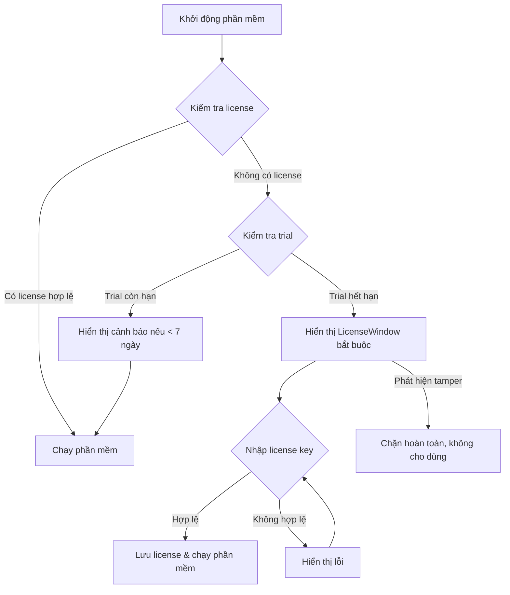

# HMI Screwing Monitor - License System Documentation

## Tổng quan

Hệ thống License đã được tích hợp vào phần mềm **HMI Screwing Monitor** để bảo vệ bản quyền và kiểm soát việc phân phối phần mềm cho khách hàng.

### Tính năng chính

✅ **Hardware ID Binding**: License gắn với phần cứng máy tính cụ thể (CPU, Motherboard, HDD)
✅ **30-day Trial Period**: Cho phép khách hàng dùng thử 30 ngày
✅ **License Key Format**: XXXXX-XXXXX-XXXXX-XXXXX-XXXXX (25 ký tự)
✅ **Permanent & Time-limited Licenses**: Hỗ trợ cả license vĩnh viễn và có thời hạn
✅ **Anti-tamper Protection**: Phát hiện việc thay đổi ngày giờ hệ thống
✅ **User-friendly UI**: Giao diện kích hoạt license thân thiện
✅ **LicenseGenerator Tool**: Công cụ tạo license key cho dev/admin

---

## Kiến trúc hệ thống

### 1. Cấu trúc thư mục

```
HMI_ScrewingMonitor/
├── Services/
│   ├── HardwareInfo.cs         # Lấy Hardware ID từ phần cứng
│   ├── LicenseKey.cs           # Generate và validate license key
│   └── LicenseManager.cs       # Quản lý trạng thái license
├── Views/
│   ├── LicenseWindow.xaml      # UI nhập license
│   └── LicenseWindow.xaml.cs   # Code-behind
├── App.xaml.cs                 # Kiểm tra license khi startup
└── LicenseGenerator/           # Tool tạo license (separate console app)
    ├── Program.cs
    ├── HardwareInfo.cs
    ├── LicenseKey.cs
    └── README.md
```

### 2. Flow hoạt động



---

## Chi tiết kỹ thuật

### 1. HardwareInfo.cs

**Chức năng**: Lấy Hardware ID duy nhất từ máy tính

**Cơ chế**:
- Sử dụng WMI (Windows Management Instrumentation) qua `System.Management`
- Lấy thông tin: CPU ID, Motherboard Serial, HDD Serial
- Hash bằng SHA256 → Lấy 32 ký tự đầu

**Code sample**:
```csharp
string hardwareId = HardwareInfo.GetHardwareId();
// Output: "A1B2C3D4E5F6G7H8I9J0K1L2M3N4O5P6"

string formatted = HardwareInfo.FormatHardwareId(hardwareId);
// Output: "A1B2-C3D4-E5F6-G7H8-I9J0-K1L2-M3N4-O5P6"
```

**Fallback**: Nếu không lấy được thông tin phần cứng, sử dụng `MachineName + UserName`

### 2. LicenseKey.cs

**Chức năng**: Generate và validate license key

**Format**: `XXXXX-XXXXX-XXXXX-XXXXX-XXXXX` (25 ký tự)

**Cấu trúc**:
```
[Signature - 20 chars][Expiry Code - 4 chars][Checksum - 1 char]
```

- **Signature**: SHA256 của (Hardware ID + Company Name + Expiry Date + Secret Key) → Lấy 20 ký tự
- **Expiry Code**:
  - `PERM` = Vĩnh viễn
  - Base36(YYMM) = Có thời hạn (VD: `2512` = Dec 2025)
- **Checksum**: Checksum để phát hiện key bị sửa

**Secret Key**: `HMI_SCREWING_MONITOR_2025_SECRET_KEY_V1` (có thể thay đổi)

**API**:
```csharp
// Generate license key
string licenseKey = LicenseKey.GenerateLicenseKey(
    hardwareId: "A1B2C3D4E5F6G7H8I9J0K1L2M3N4O5P6",
    companyName: "Toyota Vietnam",
    expiryDate: new DateTime(2025, 12, 31) // hoặc null cho vĩnh viễn
);

// Validate license key
bool isValid = LicenseKey.ValidateLicenseKey(
    licenseKey: "AB12C-34DEF-56GHI-78JKL-90MNO",
    hardwareId: currentHardwareId,
    out string companyName,
    out DateTime? expiryDate
);
```

### 3. LicenseManager.cs

**Chức năng**: Quản lý trạng thái license và trial period

**Properties**:
- `IsLicensed`: Có license hợp lệ hay không
- `IsTrialExpired`: Trial đã hết hạn chưa
- `DaysRemaining`: Số ngày trial còn lại
- `TamperDetected`: Phát hiện thay đổi ngày giờ hệ thống

**Storage**:
- **Registry**: `HKEY_CURRENT_USER\Software\HMI_ScrewingMonitor`
  - `FirstRun`: Ngày cài đặt đầu tiên (encrypted)
  - `LastRun`: Ngày chạy gần nhất (encrypted)
- **File**: `license.dat` (AES encrypted)
  - Lưu license key và thông tin kích hoạt

**Anti-tamper**:
```csharp
// Phát hiện rollback ngày giờ
if (DateTime.Today < LastRunDate)
{
    TamperDetected = true; // Chặn phần mềm
}
```

**API**:
```csharp
var licenseManager = new LicenseManager();

if (licenseManager.IsLicensed)
{
    // Đã kích hoạt license
}
else if (licenseManager.TamperDetected)
{
    // Phát hiện gian lận → Chặn
}
else if (licenseManager.IsTrialExpired)
{
    // Trial hết hạn → Yêu cầu license
}
else
{
    // Trial mode: còn X ngày
    int daysLeft = licenseManager.DaysRemaining;
}

// Kích hoạt license
bool success = licenseManager.ActivateLicense(licenseKey);
```

### 4. LicenseWindow.xaml

**Chức năng**: UI cho phép người dùng nhập license key

**Features**:
- Hiển thị Hardware ID với nút copy
- Input field cho license key (auto-format: XXXXX-XXXXX-...)
- Hiển thị trial status (số ngày còn lại)
- Success/Error messages
- Ngăn không cho đóng cửa sổ nếu trial hết hạn và chưa kích hoạt

**UI Flow**:
```
┌─────────────────────────────────────────────┐
│  🔒 Kích hoạt License                       │
├─────────────────────────────────────────────┤
│  Hardware ID của máy này:                   │
│  ┌──────────────────────────────────────┐   │
│  │ A1B2-C3D4-E5F6-G7H8-I9J0-K1L2-M3N4  │ 📋 │
│  └──────────────────────────────────────┘   │
│                                              │
│  📝 Nhập License Key:                       │
│  ┌──────────────────────────────────────┐   │
│  │ XXXXX-XXXXX-XXXXX-XXXXX-XXXXX        │   │
│  └──────────────────────────────────────┘   │
│                                              │
│  ⏰ Dùng thử: Còn 25 ngày                   │
│                                              │
│         [Kích hoạt]    [Đóng]              │
└─────────────────────────────────────────────┘
```

### 5. App.xaml.cs

**Chức năng**: Kiểm tra license khi khởi động phần mềm

**Flow**:
```csharp
protected override void OnStartup(StartupEventArgs e)
{
    base.OnStartup(e);
    CheckLicense(); // Kiểm tra license trước khi show MainWindow
}

private void CheckLicense()
{
    var licenseManager = new LicenseManager();

    if (licenseManager.IsLicensed)
    {
        return; // OK, tiếp tục chạy MainWindow
    }

    if (licenseManager.TamperDetected)
    {
        MessageBox.Show("Phát hiện hành vi gian lận. Vui lòng liên hệ support.");
        ShowLicenseWindow(required: true); // Bắt buộc phải kích hoạt
    }
    else if (licenseManager.IsTrialExpired)
    {
        MessageBox.Show("Phiên bản dùng thử đã hết hạn. Vui lòng kích hoạt license.");
        ShowLicenseWindow(required: true); // Bắt buộc
    }
    else
    {
        // Trial mode: Hiển thị cảnh báo nếu < 7 ngày
        if (licenseManager.DaysRemaining <= 7)
        {
            MessageBox.Show($"Còn lại: {licenseManager.DaysRemaining} ngày dùng thử.");
        }
    }
}
```

---

## Hướng dẫn sử dụng

### Cho Developer/Admin (Người tạo license)

#### 1. Build LicenseGenerator tool

```bash
cd LicenseGenerator
dotnet build
dotnet run
```

#### 2. Nhận Hardware ID từ khách hàng

Khách hàng chạy phần mềm → Cửa sổ license hiển thị Hardware ID → Gửi cho bạn

#### 3. Tạo License Key

Chạy **LicenseGenerator** → Chọn `1. Tạo License Key`

**Input**:
- Hardware ID: `A1B2-C3D4-E5F6-G7H8-I9J0-K1L2-M3N4-O5P6`
- Công ty: `Toyota Vietnam`
- Loại: `1` (vĩnh viễn) hoặc `2` (có thời hạn, nhập ngày hết hạn)

**Output**:
```
🔑 LICENSE KEY:
   ╔════════════════════════════════════╗
   ║  AB12C-34DEF-56GHI-78JKL-90MNOP  ║
   ╚════════════════════════════════════╝
```

#### 4. Gửi License Key cho khách hàng

Email/Chat license key cho khách hàng

### Cho End User (Khách hàng)

#### 1. Chạy phần mềm lần đầu

Phần mềm sẽ vào chế độ dùng thử 30 ngày

#### 2. Khi cần kích hoạt license

- Mở cửa sổ License (tự động hiện khi trial hết hạn, hoặc từ menu Settings)
- Copy **Hardware ID**
- Gửi Hardware ID cho nhà cung cấp
- Nhận **License Key** từ nhà cung cấp
- Nhập License Key vào phần mềm → Nhấn **Kích hoạt**

#### 3. Hoàn tất

Phần mềm đã được kích hoạt vĩnh viễn (hoặc đến ngày hết hạn)

---

## Testing

### Test case 1: Trial mode

1. Xóa registry key: `HKEY_CURRENT_USER\Software\HMI_ScrewingMonitor`
2. Xóa file `license.dat`
3. Chạy phần mềm
4. Kiểm tra: Phần mềm chạy được, hiển thị còn 30 ngày trial

### Test case 2: Kích hoạt license vĩnh viễn

1. Lấy Hardware ID từ cửa sổ License
2. Chạy LicenseGenerator → Tạo license vĩnh viễn
3. Nhập license key vào phần mềm
4. Kiểm tra: Kích hoạt thành công, cửa sổ License đóng

### Test case 3: License có thời hạn

1. Tạo license với ngày hết hạn = 7 ngày sau
2. Kích hoạt license
3. Kiểm tra: Kích hoạt thành công
4. Sau 7 ngày: Phần mềm yêu cầu license mới

### Test case 4: Anti-tamper (Rollback date)

1. Kích hoạt phần mềm (ngày 1/1/2025)
2. Đóng phần mềm
3. Đổi ngày hệ thống về 31/12/2024
4. Chạy lại phần mềm
5. Kiểm tra: Phát hiện tamper, yêu cầu kích hoạt lại

### Test case 5: License không đúng Hardware ID

1. Tạo license cho Hardware ID của máy A
2. Nhập license đó vào máy B
3. Kiểm tra: Báo lỗi "License không hợp lệ"

---

## Bảo mật

### Điểm mạnh

✅ **Hardware binding**: License gắn với phần cứng cụ thể
✅ **SHA256 signature**: Không thể reverse engineer để tìm secret key
✅ **Checksum validation**: Phát hiện license key bị sửa
✅ **Registry encryption**: Ngày trial được mã hóa trong registry
✅ **Anti-tamper**: Phát hiện rollback ngày giờ hệ thống
✅ **AES encryption**: File license.dat được mã hóa AES

### Điểm yếu và cách khắc phục

⚠️ **Secret key trong source code**:
- **Khắc phục**: Obfuscate code trước khi phân phối (ConfuserEx, .NET Reactor)

⚠️ **Registry có thể bị xóa**:
- **Khắc phục**: Lưu backup ở nhiều nơi (file hidden, WMI, multiple registry keys)

⚠️ **Debugger có thể bypass license check**:
- **Khắc phục**: Anti-debugging techniques, code obfuscation

⚠️ **Hardware ID có thể thay đổi khi thay phần cứng**:
- **Khắc phục**: Hỗ trợ "reset license" cho khách hàng khi thay phần cứng

---

## Troubleshooting

### Lỗi: "License không hợp lệ"

**Nguyên nhân**:
- Hardware ID không khớp
- License key bị nhập sai
- License đã hết hạn
- Checksum không đúng

**Giải pháp**:
1. Kiểm tra Hardware ID có đúng không
2. Kiểm tra license key có đầy đủ 25 ký tự không
3. Sử dụng LicenseGenerator chức năng `3. Validate` để debug

### Lỗi: "Phát hiện hành vi gian lận"

**Nguyên nhân**:
- Ngày hệ thống bị rollback

**Giải pháp**:
1. Đặt lại ngày hệ thống về hiện tại
2. Liên hệ support để reset license

### Lỗi: "Không thể lưu license"

**Nguyên nhân**:
- Không có quyền ghi registry
- Không có quyền tạo file license.dat

**Giải pháp**:
- Chạy phần mềm với quyền Administrator

---

## Tùy chỉnh

### Thay đổi thời gian trial

File: `Services/LicenseManager.cs`
```csharp
private const int TRIAL_DAYS = 30; // Đổi thành số ngày mong muốn
```

### Thay đổi Secret Key

File: `Services/LicenseKey.cs` và `LicenseGenerator/LicenseKey.cs`
```csharp
private const string SECRET_KEY = "HMI_SCREWING_MONITOR_2025_SECRET_KEY_V1";
// Đổi thành chuỗi riêng của bạn
```

⚠️ **Lưu ý**: Phải thay đổi ở CẢ HAI file (main app và LicenseGenerator)

### Thay đổi cảnh báo trial

File: `App.xaml.cs`
```csharp
if (licenseManager.DaysRemaining <= 7) // Đổi số ngày cảnh báo
{
    MessageBox.Show($"Còn lại: {licenseManager.DaysRemaining} ngày dùng thử.");
}
```

---

## Changelog

### Version 1.0 (2025-10-11)

✅ Implement complete license system
✅ Hardware ID binding
✅ 30-day trial period
✅ Permanent & time-limited licenses
✅ Anti-tamper protection
✅ LicenseGenerator console tool
✅ User-friendly activation UI

---

## Liên hệ Support

Nếu có vấn đề về license system, vui lòng liên hệ:
- Email: support@example.com
- Documentation: README.md, LICENSE_SYSTEM.md

---

**Developed for HMI Screwing Monitor v1.0**
